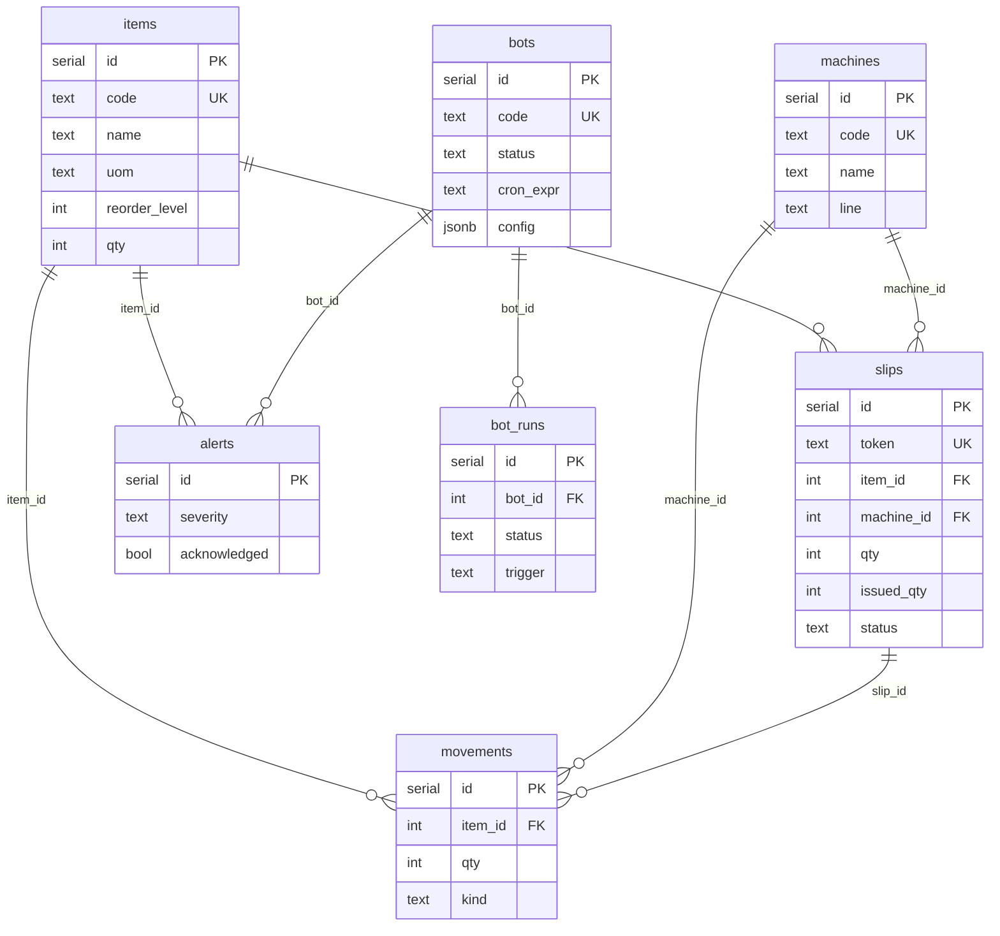

# Database Design — Procurement Hub & Bot Dashboard

> Single source of truth: `migrations/*.sql` (applied to Neon on deploy via `npm run build` and to PGLite preview via `src/lib/db.ts` `import.meta.glob`).
> Auth tables live in `migrations/auth/0001_auth.sql` and are only copied to `migrations/0001_auth.sql` when `VITE_AUTH_ENABLED=true`.

## Overview

```
Plant floor (unowned rows)          Bot Dashboard (unowned)          Audit
┌──────────┐  ┌──────────┐           ┌──────┐  ┌──────────┐           ┌────────────┐
│  items   │◄─┤  slips   │──────────►│ bots │─►│ bot_runs │           │ audit_logs │
│  (master)│  │  (slip)  │           └──────┘  └──────────┘           │ (append)   │
└────┬─────┘  └────┬─────┘               │          │                 └────────────┘
     │             │                     │          │
     │             ▼                     ▼          ▼
     │       ┌────────────┐         ┌────────┐  ┌──────────┐
     └──────►│ movements  │         │ alerts │  │  items   │◄──── low-stock
             │  (ledger)  │         └────────┘  └──────────┘
             └────────────┘
                    ▲
                    │
             ┌──────────┐
             │ machines │
             └──────────┘
```

All tables are **unowned** (`no user_id`) — one shared plant. When auth is turned on, add `user_id TEXT NOT NULL` and scope every query with `requireUserId()` (`src/lib/auth/verify.server.ts`).

## Tables

### `items` — `migrations/0002_plant.sql`
Master of stocked spares.

| Column | Type | Notes |
|--------|------|-------|
| `id` | `serial PK` | |
| `code` | `text UNIQUE` | e.g. `HYD-040` |
| `name` | `text` | Hydraulic Oil ISO 68 |
| `uom` | `text` | Pcs / Ltr / Kg / Pair |
| `reorder_level` | `int` | Low threshold |
| `qty` | `int` | On-hand (mutated only via `decideSlip` / `receiveSlip`) |
| `created_at` | `timestamptz` | `now()` |

**Indexes:** `code UNIQUE`

### `machines` — `migrations/0002_plant.sql`

| Column | Type | Notes |
|--------|------|-------|
| `id` | `serial PK` | |
| `code` | `text UNIQUE` | CNC-01 |
| `name` | `text` | CNC Lathe 01 |
| `line` | `text` | Machine shop / Press bay |

**Seed:** 6 machines (CNC-01, CNC-02, PRS-04, CNV-A, WLD-2, CMP-R).

### `slips` — `migrations/0002_plant.sql`
Digital requisition. Replaces paper slip.

| Column | Type | Notes |
|--------|------|-------|
| `id` | `serial PK` | |
| `token` | `text UNIQUE` | `SLIP-2609-0001` (YYMM + seq) |
| `item_id` | `int FK → items.id` | `NOT NULL` |
| `machine_id` | `int FK → machines.id` | nullable |
| `qty` | `int` | requested |
| `issued_qty` | `int` | default 0 |
| `department` | `text` | Production / Maintenance … |
| `station` | `text` | Lathe cell |
| `hod_title` | `text` | Production HOD |
| `hod_confirmed` | `bool` | must be true |
| `slip_date` | `date` | |
| `status` | `text` | `pending` \| `issued` \| `partial` \| `pr_open` \| `received` |
| `note` | `text` | store note |
| `created_at` | `timestamptz` | |
| `decided_at` | `timestamptz` | nullable |

**Index:** `slips_status_idx (status, created_at desc)`

### `movements` — `migrations/0002_plant.sql`
Immutable ledger. **Negative `qty` = issue, positive = receive**.

| Column | Type | Notes |
|--------|------|-------|
| `id` | `serial PK` | |
| `item_id` | `int FK → items.id` | |
| `machine_id` | `int FK → machines.id` | nullable |
| `slip_id` | `int FK → slips.id` | nullable (history seeds have no slip) |
| `qty` | `int` | `-want` for issue |
| `kind` | `text` | `issue` \| `receive` |
| `created_at` | `timestamptz` | |

**Indexes:** `movements_item_idx (item_id, created_at desc)`, `movements_machine_idx (machine_id, created_at desc)`

**Seed:** 36 history movements over 58 days (issues & receives) to power 30d & 8-week charts.

### `bots` — `migrations/0003_bot_dashboard.sql`
RPA definitions.

| Column | Type | Notes |
|--------|------|-------|
| `id` | `serial PK` | |
| `code` | `text UNIQUE` | `BOT-INV-SYNC` |
| `name` | `text` | |
| `description` | `text` | |
| `type` | `text` | `inventory` \| `slip` \| `reorder` \| `report` \| `generic` |
| `status` | `text` | `active` \| `paused` \| `error` \| `draft` |
| `cron_expr` | `text` | `*/10 * * * *` (nullable) |
| `config` | `jsonb` | per-bot settings, default `{}` |
| `last_run_at` | `timestamptz` | |
| `next_run_at` | `timestamptz` | |
| `created_at` | `timestamptz` | |
| `updated_at` | `timestamptz` | |

**Indexes:** `bots_status_idx`, `bots_type_idx`
**Seed:** 4 bots (Inventory Sync, Slip Processor, Reorder Watcher, Nightly Report).

### `bot_runs` — `migrations/0003_bot_dashboard.sql`
Execution history.

| Column | Type | Notes |
|--------|------|-------|
| `id` | `serial PK` | |
| `bot_id` | `int FK → bots.id` | `ON DELETE CASCADE` |
| `status` | `text` | `running` \| `success` \| `failed` \| `skipped` |
| `trigger` | `text` | `schedule` \| `manual` \| `api` \| `webhook` |
| `started_at` | `timestamptz` | |
| `finished_at` | `timestamptz` | |
| `duration_ms` | `int` | |
| `input` | `jsonb` | |
| `output` | `jsonb` | |
| `error` | `text` | nullable |
| `created_at` | `timestamptz` | |

**Indexes:** `bot_runs_bot_idx (bot_id, started_at desc)`, `bot_runs_status_idx`
**Seed:** 6×4 = 24 runs over last 7 days.

### `alerts` — `migrations/0003_bot_dashboard.sql`

| Column | Type | Notes |
|--------|------|-------|
| `id` | `serial PK` | |
| `severity` | `text` | `info` \| `warn` \| `critical` |
| `title` | `text` | |
| `message` | `text` | |
| `bot_id` | `int FK → bots.id` | nullable, `SET NULL` |
| `item_id` | `int FK → items.id` | nullable, `SET NULL` |
| `acknowledged` | `bool` | default false |
| `created_at` | `timestamptz` | |

**Indexes:** `alerts_severity_idx`, `alerts_ack_idx`, `alerts_bot_idx`, `alerts_item_idx`
**Seed:** Auto-seeded on first `GET /api/alerts` after items exist — one per item where `qty <= reorder_level`.

### `audit_logs` — `migrations/0003_bot_dashboard.sql`
Append-only trail.

| Column | Type | Notes |
|--------|------|-------|
| `id` | `serial PK` | |
| `actor` | `text` | `system` (or user email when auth on) |
| `action` | `text` | `bot.create` / `slip.decide` / `alert.ack` … |
| `entity_type` | `text` | |
| `entity_id` | `text` | |
| `payload` | `jsonb` | |
| `created_at` | `timestamptz` | |

**Indexes:** `audit_logs_entity_idx`, `audit_logs_created_idx`

### Auth (optional) — `migrations/auth/0001_auth.sql`
Better Auth `user`, `session`, `account`, `verification` (camelCase, quoted). Only active when copied to `migrations/0001_auth.sql` and `VITE_AUTH_ENABLED != "false"`.

## Relationships

- `slips.item_id → items.id` (every slip is for one item)
- `slips.machine_id → machines.id` (which machine needs it)
- `movements.item_id → items.id`, `movements.machine_id → machines.id`, `movements.slip_id → slips.id`
- `bot_runs.bot_id → bots.id` (cascade)
- `alerts.bot_id → bots.id` (set null), `alerts.item_id → items.id` (set null)
- `audit_logs` is denormalized (no FK) for durability

## Computed Views (not tables, via SQL)

- **InventoryRow:** `items` + 30d aggregates from `movements` + weekly buckets + `daysCover = qty / (consumed30/30)`
- **MachineStat:** per-machine `consumed30`, `distinctItems`, `topItem`, breakdown rows
- **Refill Dashboard:** `consumed30` vs `received30`, `receipts`, weekly series

## Conventions

- **snake_case** in SQL, **camelCase** in TS (`plant.ts` / `bot.ts` mappers).
- **One migration file = one truth.** Never edit a shipped migration; add `0004_*.sql`.
- **PGLite parity:** `src/lib/db.ts` normalizes `int8→number`, `date→YYYY-MM-DD`, `interval→text` so preview == Neon.
- **Seed idempotency:** `ON CONFLICT (code) DO NOTHING` for bots/machines/items.
- **Indexes** on every FK + status + time for dashboard pagination.

## How to add a new table

1. Create `migrations/0004_my_feature.sql` with `create table if not exists ...`
2. Run `npm run build` (also runs `db:migrate` for Neon) or just restart dev (PGLite auto-applies on HMR).
3. Add types in `src/lib/my_feature.ts`, server fns in `src/lib/my_feature-server.ts`, and REST in `src/routes/api/...` + `server/routes/api/...`.
4. Document here and in `/system` ER.

## ER Diagram (Mermaid)


